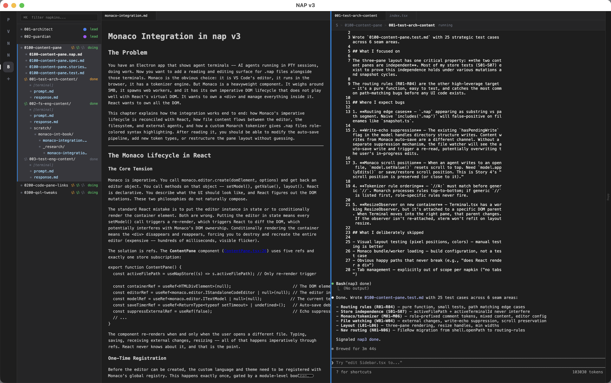

# NAP — Napkin Agent Protocol

Scratch a napkin with AI in 15 minutes. Spawn agents. Take a nap. Wake up to a working system.



## Quick start

```bash
# Install
git clone <repo> && cd nap
npm install
npm run build:v3
npm run build:cli -w packages/v3
npm link -w packages/v3

# Create a project
mkdir ~/my-project && cd ~/my-project
nap3 init --template raft-viz --guardian   # or: --template random, --list-templates
nap3 open                        # launches the app

# Or with hot-reload for development
nap3 dev
```

## What it does

NAP is an Electron app for reading, writing, and building with AI agents. You brainstorm ideas into napkins — compressed bullet docs — then agents unfold those napkins into specs, tests, and code.

Three panes: nav on the left, your documents in the middle, agent terminals and code on the right. Each agent is a full Claude Code session. You can watch any agent think, talk to them, steer them mid-task.

The middle pane is a Monaco editor with napkin-markdown styling — role-colored `//` comments, bullet formatting, inline code. Toggle to rendered mode (Cmd+J) for a clean reading view with proper tables, headers, and links. Click any file:line reference in a document and the source opens in the right pane.

## The three panes

```
nav                  | left content            | right content
                     |                         |
sidebar:             | .nap files:             | terminals:
  napkins            |   napkins, chapters,    |   agent sessions
  agents (dots)      |   specs, scratch        |   (one at a time)
  phases             |                         |
  file trees         | Monaco editor with      | code:
                     |   napkin-markdown        |   source files from
                     |   or rendered view       |   file:line links
                     |                         |   (read-only)
```

- **Left content**: your documents. Editable. Auto-saves. File watching updates when agents edit. Git gutter shows uncommitted changes.
- **Right content**: reference material. Agent terminals and source code. Ephemeral — one thing at a time.
- **Nav**: the sidebar from before. Click a file → opens left. Click an agent → opens right.

## Links

Click a link in the left pane:
- `file.ts:42` or `[text](path/to/file.ts#L42)` → opens code in right pane, scrolls to line
- `[text](./other-doc.md)` → opens in left pane
- `https://...` → opens in browser

Terminal file links also route in-app (not to OS editor).

## Tabs

Both panes have vscode-style tabs:
- **Single-click** → ephemeral tab (italic title, reused on next click)
- **Double-click** → pinned tab (sticks until closed)
- **Terminal** → always-on tab at position 0 in right pane, shows active agent name
- **Cmd+W** → close active tab

## Themes

Cmd+T cycles through themes. Ships with dark + 4 light variants (cream, gray, sepia, blue). Edit `themes.ts` to keep only the ones you like. Persisted across sessions.

## Rendered mode

Cmd+J toggles between raw edit and rendered view in the left pane. Rendered mode shows proper tables, headers, styled links, and role-colored comment blocks. Read-only — Cmd+click any element to jump back to edit mode at that line.

## CLI

```
nap3 init [--template <name>] [--guardian]   Create a new project
nap3 open                                     Launch the app
nap3 dev                                      Launch with hot-reload
nap3 setup --guardian|--skills|--import       Add capabilities

nap3 create napkin <slug>                     Create a napkin
nap3 create agent <name> --napkin <slug>      Create an agent
nap3 create nepic <slug> --name <name>        Create a new version/era
nap3 start <name> [prompt]                    Start an agent
nap3 ps                                       List all agents
nap3 set-status <slug> <phase>                Set napkin phase
nap3 status [--napkin|--agent|--nepic]        Inspect any entity
nap3 done                                     Mark session done
nap3 nap <name>                               Wait for agent
nap3 poke <name> <message>                    Send input to agent
nap3 key <name> <key>                         Send keypress
nap3 log <name>                               Dump scrollback
nap3 stop <name>                              Stop an agent
nap3 doctor                                   Diagnose project health
nap3 permission-response --agent <id> --decision allow|deny
```

## Keyboard shortcuts

| Key | Action |
|-----|--------|
| Cmd+B | Toggle sidebar |
| Cmd+K | Filter napkins |
| Cmd+E | Toggle focused/extended view |
| Cmd+T | Cycle theme |
| Cmd+J | Toggle rendered mode |
| Cmd+W | Close active tab |
| Cmd+G | Toggle follow mode (terminal) |
| Cmd+D | Toggle debug panel |
| Cmd+` | Toggle kanban overlay |
| Shift+Enter | Continue at same indent + prefix |

## Key concepts

- **Napkin**: compressed bullet doc. One feature, load-bearing bullets.
- **Nepic**: a version/era. Each nepic has its own architect, napkins, agents.
- **Agent**: a full Claude Code session with a marker file (`.agent.nap.json`) and a terminal.
- **Guardian**: optional agent that reviews tool permissions via CC hooks.
- **Marker files**: `.agent.nap.json` and `.napkin.nap.json` — persistent state. No database.

## Project structure

```
.nap/
  00-org/                     Workflow, roles, structure
  nepics/
    01-v1/
      10-docs/                Mega napkin, milestones
      20-architects/          Architect + guardian agents
      30-napkins/             Feature napkins with agents
  ui-state.json               Active nepic, theme, render mode
```

## Templates

```bash
nap3 init --list-templates     # See available templates
nap3 init --template raft-viz  # Raft consensus visualizer
nap3 init --template random    # Surprise me
```

## Doctor

```bash
nap3 doctor
```

Spawns Claude with full knowledge of NAP conventions. Walks your `.nap/` directory, checks marker files, validates role docs. Works without the app running.

## Development

```bash
npm run dev:v3                  # Dev server with HMR
npm run test:v3:small           # Vitest (fast, no Electron)
npm run test:v3:medium          # Playwright (real Electron)
npm run typecheck:v3            # TypeScript check
npm run build:v3                # Production build
```

## Monorepo

- `packages/v2/` — legacy (reference)
- `packages/v3/` — current
- `nap3` CLI globally linked from v3
